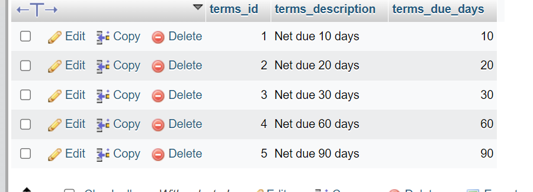

# dba120-exam1

## Exercise 1:
* This statement creates a new row in the `terms` table.

``
INSERT INTO terms (terms_id, terms_description, terms_due_days)
VALUES ('6', 'Net due 120 days', '120');
``

## Exercise 2:
* This statement updates the `terms_description` and `terms_due_days` in the `terms` table for `terms_id = 6`

``
UPDATE terms
SET terms_description = 'Net due 125 days',
  terms_due_days = '125'
WHERE terms_id = 6;
``

## Exercise 3:
* This statement deletes `terms_id = 6` from the `terms` table

``
DELETE FROM terms
WHERE terms_id = 6
``

## Exercise 4:
* This statement inserts everything within `VALUES ()` into the `invoices` table

``
INSERT INTO invoices
VALUES (NULL, 32, 'AX-014-027', '2018-08-01', 434.58, 0.00, 0.00,2, '2018-08-31', null)
``

## Exercise 5:
* This statement inserts 2 new records into the `invoice_line_items` table, while also using select statements to retreive the `invoice_id` from the `invoices` table

``
INSERT INTO invoice_line_items (invoice_id, invoice_sequence, account_number, line_item_amount, line_item_description)
VALUES
((SELECT MAX(invoice_id) FROM invoices), 1, 160, 180.23, 'Hard drive'),
((SELECT MAX(invoice_id) FROM invoices), 2, 527, 254.35, 'Exchange Server update');
``

## Exercise 6:
* This statement updates the `credit_total` and `payment total` for `invoice_id = 115` in the `invoices` table utilizing 2 math expression's in the statement

``
UPDATE invoices
SET credit_total = invoice_total * 0.1,
    payment_total = invoice_total - credit_total
WHERE invoice_id = 115;
``

## Exercise 7:
* This statement updates the `default_account_number` of `vendor_id = 44` to the number 403

``
UPDATE vendors
SET default_account_number = 403
WHERE vendor_id = 44
``

## Exercise 8:
* This statement updates the `terms_id` in the `invoices` table while selecting the `vendor_id` from the `vendors` table while targeting a specific record where `default_terms_id = 2`

``
UPDATE invoices
SET terms_id = 2
WHERE vendor_id in (
  SELECT vendor_id
  FROM vendors
  WHERE default_terms_id = 2);
``

## Exercise 9:
* This statement deletes `invoice_id = 115` from both `invoice_line_items` and the `invoices` tables

``
DELETE FROM invoice_line_items
WHERE invoice_id = 115;
DELETE FROM invoices
WHERE invoice_id = 115;
``

